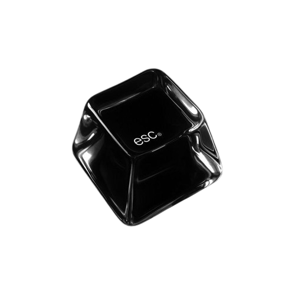

  
  

 

<h2 align="center">  <em>About  me </em></h2>

 

  Hello There! <em><b> I'm Paulo Vitor </b></em>, a Computer Science student exploring the world of technology..

 

      <em><b> Catholic University of Brasília </b></em>  

 
 
<h2 align="center">  <em> Technologies </em> </h2>

  
  
  
  
  
  

 
 

